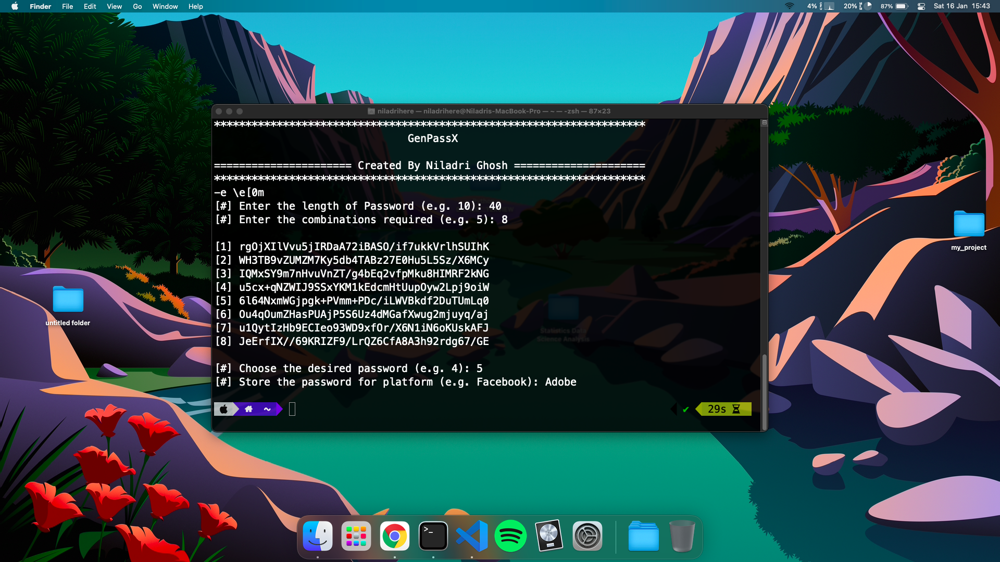

# Generate Random Password

GenPassX  - Beta 0.1a 

The whole project was made using bash scripting. Secured with base64 and custom combination, save it to your file for safekeeping.

## Contents

- [Usage](#configuration)
- [Current Status](#current-status)
- [Improvements](#improvements)
- [Credits](#credits)

## Usage
- Cross platform support as long as it supports bash or similar shell.
- Open **generate.sh** script or just drap n drop it into your terminal.
- Works perfectly fine with linux and Unix systems, need shell support on Windows.

## Current Status
- **Version : 0.1a**
- **Generate secure password** using base64 encoding using 48 characters 
- **Save password** in the same directory, password.txt.

## Improvements
- The script can be implemented on a GUI inteface for better user experience.
- Can be implemented using Python with Tkiter library for GUI support.

## Credits

- **Special thanks** to [Stackoverflow](https://stackoverflow.com/) for providing implementation support.
- Thanks to [TutorialsPoint](https://www.tutorialspoint.com/unix/shell_scripting.htm) for providing extensive help out.
- A huge thanks to the Google, for providing such a powerful search engine.😉
